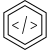

<!-- [![Build][build-shield]][build-url]
[![Coverage][coverage-shield]][coverage-url] -->
[![Language][language-shield]][build-url]
[![MIT License][license-shield]][license-url]
[![LinkedIn][linkedin-shield]][linkedin-url]

 

  

<h3 align="center">uebelacker.ch</h3>
  

    My small homepage. A place to try things out and promote my own projects.
  

## About

This repository holds my homepage https://uebelacker.ch which I primarily use to try things out and promote my own projects.

### Built With

* [Next.js](https://nextjs.org/)

## License

MIT License. See `LICENSE.txt` for more information.

[build-shield]: https://img.shields.io/github/workflow/status/uebelack/uebelacker.ch/Build.svg?style=for-the-badge
[build-url]: https://github.com/uebelack/uebelacker.ch/actions/workflows/main.yml
[language-shield]: https://img.shields.io/github/languages/top/uebelack/uebelacker.ch.svg?style=for-the-badge
[language-url]: https://github.com/uebelack/uebelacker.ch
[coverage-shield]: https://img.shields.io/coveralls/github/uebelack/uebelacker.ch.svg?style=for-the-badge
[coverage-url]: https://coveralls.io/github/uebelack/uebelacker.ch
[license-shield]: https://img.shields.io/github/license/uebelack/uebelacker.ch.svg?style=for-the-badge
[license-url]: https://github.com/uebelack/uebelacker.ch/blob/master/LICENSE.txt
[linkedin-shield]: https://img.shields.io/badge/-LinkedIn-black.svg?style=for-the-badge&logo=linkedin&colorB=555
[linkedin-url]: https://linkedin.com/in/david-übelacker-600262222
